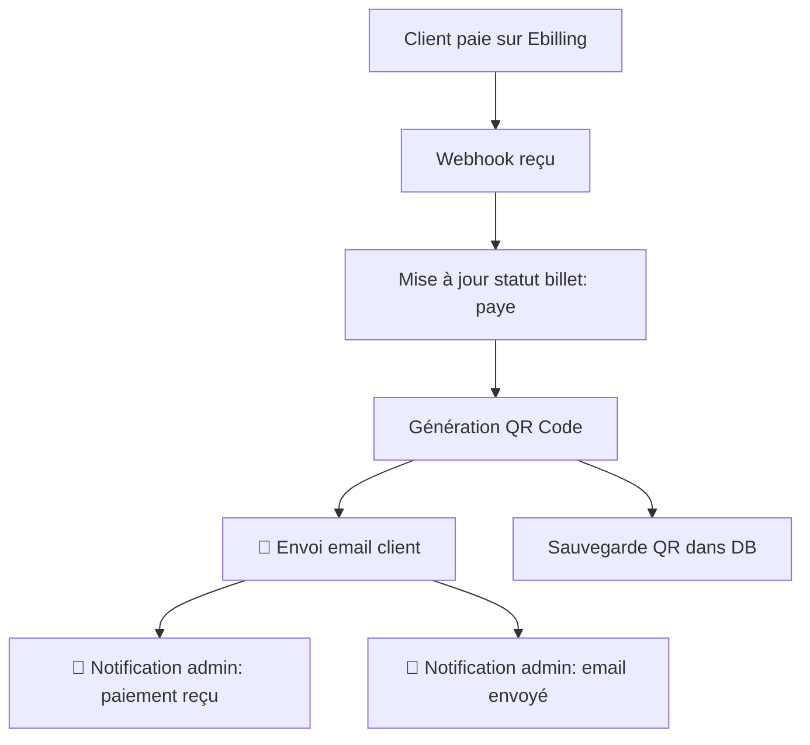
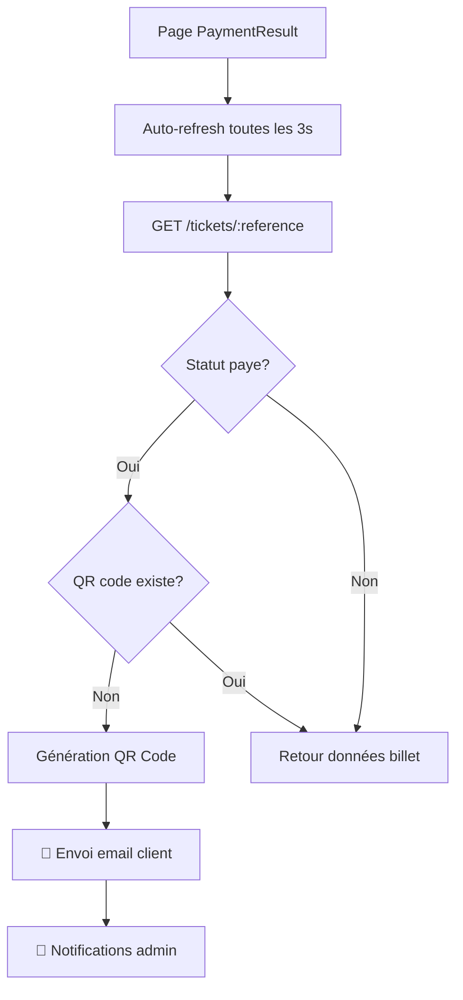
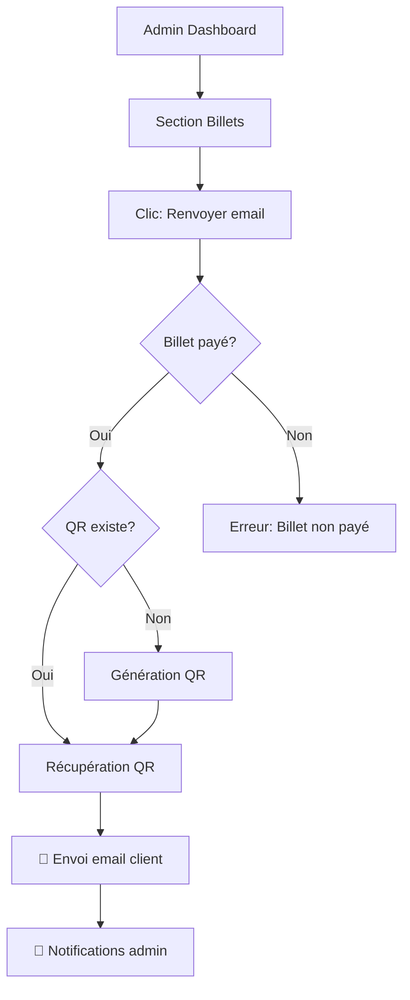

# 📧 Système de Notifications Email - Rotary

## Vue d'ensemble

Le système envoie automatiquement des emails dans les scénarios suivants :
1. **Email au client** : Billet électronique avec QR code après paiement confirmé
2. **Email à l'admin** : Notification de nouveau paiement reçu
3. **Email à l'admin** : Confirmation d'envoi d'email au client

## Configuration requise

### Variables d'environnement (.env)

```env
EMAIL_USER=votre.email@gmail.com
EMAIL_PASS=votre_mot_de_passe_app_gmail
ADMIN_EMAIL=admin@votredomaine.com
```

### Configuration Gmail

1. Activer l'authentification à deux facteurs sur votre compte Gmail
2. Générer un mot de passe d'application :
   - Aller dans Paramètres Google > Sécurité > Validation en deux étapes
   - Mots de passe des applications > Sélectionner "Autre" > Nommer "Rotary App"
   - Copier le mot de passe généré dans `EMAIL_PASS`

## Fonctionnalités

### 1. Email automatique au client (Paiement confirmé)

**Déclencheur** : Webhook Ebilling reçoit une confirmation de paiement

**Contenu** :
- ✅ Confirmation de paiement
- 🎫 Référence du billet
- 📅 Détails de l'événement (date, lieu, heure)
- 👤 Informations du participant
- 💰 Montant payé
- 🔲 **QR Code** (300x300px, attaché en inline)
- 📝 Notes du participant (si présentes)
- ⚠️ Instructions importantes

**Template** : HTML responsive avec styles inline

**Route** : `/rotary/webhook` (POST)

### 2. Notification admin - Nouveau paiement

**Déclencheur** : Immédiatement après confirmation de paiement

**Contenu** :
- 💰 Notification de nouveau paiement
- 👤 Informations client complètes
- 🎫 Référence du billet
- 💵 Montant et quantité
- 📅 Détails de l'événement

**Destinataire** : `ADMIN_EMAIL` (ou `EMAIL_USER` par défaut)

### 3. Notification admin - Email client envoyé

**Déclencheur** : Après envoi réussi de l'email au client

**Contenu** :
- ✅ Confirmation d'envoi réussi
- 👤 Informations client
- 🎫 Référence du billet
- 📧 Adresse email du destinataire
- ✔️ Liste des éléments envoyés au client

## Routes API

### Envoi manuel d'email (Admin)

```http
POST /rotary/tickets/:reference/resend-email
Authorization: Bearer <admin_token>
```

**Paramètres** :
- `reference` : Référence du billet (ex: BIL-20260117-F7FB94)

**Conditions** :
- ✅ Billet doit avoir le statut "paye"
- ✅ Token admin valide requis

**Réponse** :
```json
{
  "success": true,
  "message": "Email envoyé avec succès",
  "recipient": "client@example.com"
}
```

**Utilisation depuis le Dashboard Admin** :
- Aller dans la section "Billets"
- Cliquer sur le bouton "Renvoyer email" pour les billets payés
- Confirmer l'action dans la popup

## Flux d'exécution

### Scénario 1 : Paiement via Ebilling



### Scénario 2 : Vérification du statut (Auto-refresh)



### Scénario 3 : Envoi manuel depuis Admin



## Logs et Traçabilité

### Table `rotary_email_logs`

Chaque envoi d'email est enregistré :

```sql
INSERT INTO rotary_email_logs 
(id, billet_id, recipient_email, email_type, subject, sent_at, statut, error_message)
```

**Types d'email** :
- `billet_envoye` : Email de billet au client
- `admin_notification_payment` : Notification paiement à l'admin
- `admin_notification_email` : Notification email envoyé à l'admin

**Statuts** :
- `sent` : Envoyé avec succès
- `failed` : Échec d'envoi

### Logs console

Le système affiche des logs détaillés :

```
🎉 PAIEMENT CONFIRMÉ - Billet validé!
📧 Préparation de l'envoi de l'email...
🔲 Génération du QR code...
✅ QR code généré avec succès
✅ QR code enregistré dans la base de données
✅ Email envoyé avec succès: <messageId>
✅ Notification admin envoyée (payment_received) à: admin@email.com
✅ Notification admin envoyée (email_sent) à: admin@email.com
```

## Interface Admin

### Dashboard > Billets

**Fonctionnalités** :
- 🔍 Recherche par référence, nom, email
- 📊 Affichage du statut de paiement
- 📧 Bouton "Renvoyer email" (uniquement pour billets payés)
- 🎨 Badge coloré selon statut :
  - 🟢 Vert : payé
  - 🟡 Jaune : en attente
  - 🔴 Rouge : échoué

**Bouton Renvoyer Email** :
- Visible seulement si `statut_paiement === 'paye'`
- Confirmation avant envoi
- Feedback visuel (alert) après envoi

## Gestion des erreurs

### Échec d'envoi email

Le système continue même en cas d'échec :
- ✅ Le billet reste validé
- ✅ Le QR code est généré et sauvegardé
- ❌ L'erreur est loggée dans `rotary_email_logs`
- 📧 L'admin peut renvoyer manuellement

### QR Code manquant

Si le QR code n'existe pas lors d'une vérification :
- 🔄 Génération automatique
- 💾 Sauvegarde dans la base
- 📧 Envoi automatique de l'email

## Test manuel

### 1. Tester l'envoi automatique

```bash
node scripts/testEmailAutomatic.js
```

### 2. Tester via API

```bash
# Envoyer manuellement un email
curl -X POST http://localhost:5000/rotary/tickets/BIL-20260117-F7FB94/resend-email \
  -H "Authorization: Bearer <admin_token>"
```

### 3. Simuler un webhook

```bash
curl -X POST http://localhost:5000/rotary/webhook \
  -H "Content-Type: application/json" \
  -d '{
    "billingid": "5550057541",
    "reference": "REF-ROTARY-XXXXX",
    "state": "paid",
    "amount": 70000
  }'
```

## Sécurité

- ✅ Route `/resend-email` protégée par JWT admin
- ✅ Mot de passe email stocké en variable d'environnement
- ✅ Validation du statut avant envoi
- ✅ Logs complets pour audit

## Troubleshooting

### Email non reçu

1. Vérifier les logs : `rotary_email_logs`
2. Vérifier EMAIL_USER et EMAIL_PASS
3. Vérifier le dossier spam du client
4. Tester avec un autre email
5. Vérifier que Gmail autorise les applications moins sécurisées

### QR Code non généré

1. Vérifier que `qrcode` est installé : `npm list qrcode`
2. Vérifier les logs console
3. Tester la génération manuellement

### Notification admin non reçue

1. Vérifier `ADMIN_EMAIL` dans .env
2. Par défaut, utilise `EMAIL_USER`
3. Vérifier les logs : fonction `sendAdminNotification()`

## Améliorations futures

- [ ] Queue d'emails (Redis/Bull)
- [ ] Templates personnalisables par événement
- [ ] Email de rappel avant événement
- [ ] Email de feedback après événement
- [ ] Dashboard des statistiques d'emails
- [ ] Support multi-langues
- [ ] Webhook de vérification Gmail (bounce, ouverture)

## Support

Pour toute question : smebedoh33@gmail.com
